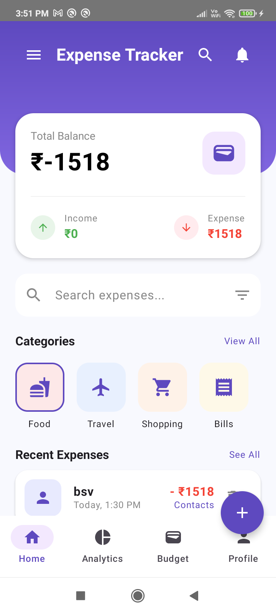
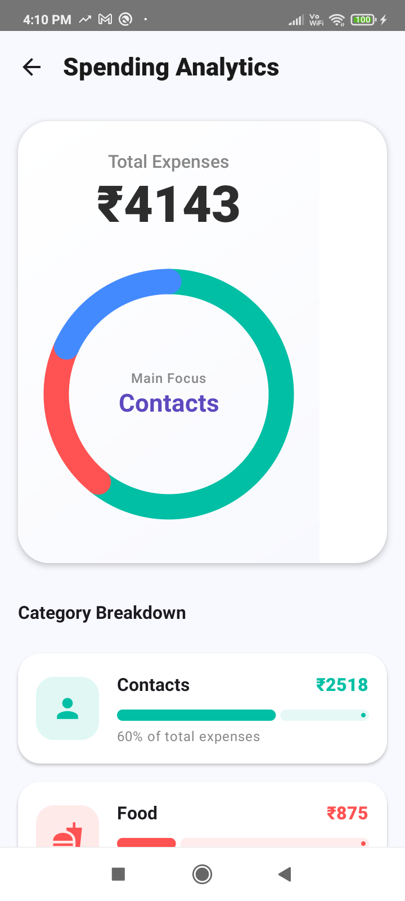
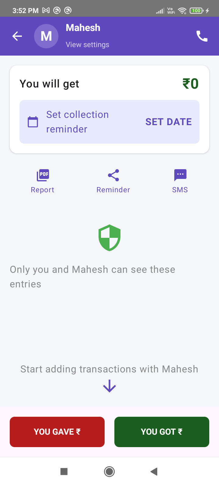
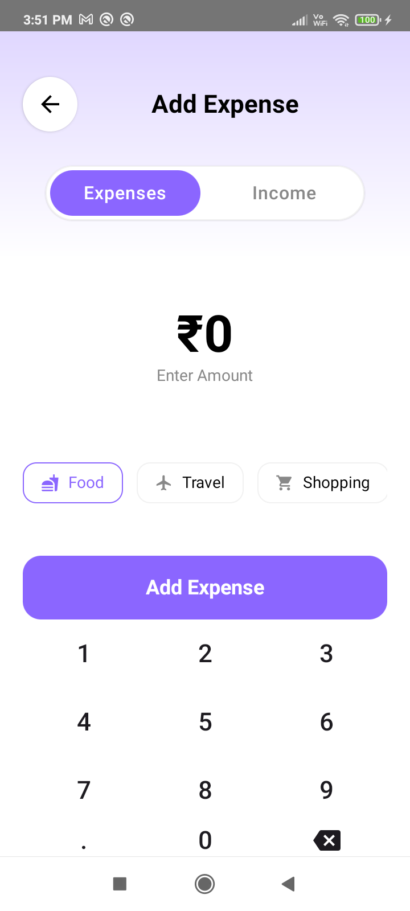

# 💰 ExpenseTracker - Smart Finance Manager

<p align="center">
  
</p>

<p align="center">
  
  
  
  
</p>

**ExpenseTracker** is a modern, professional Android application built with **Jetpack Compose** and **Material 3**. Designed with the **MVVM architecture**, it provides a seamless and robust experience for managing personal finances, tracking debts, and analyzing spending patterns.

## 📸 App Showcase

<p align="center">
  
  
  
</p>

<p align="center">
  
  
</p>

## ✨ Key Features

- **📊 Visual Spending Analytics:** Interactive charts built with custom Compose Canvas to visualize financial data.
- **👛 Smart Budgeting:** Set and monitor monthly budget limits with real-time progress tracking.
- **👥 Contact-Based Ledger:** Track "Got" and "Gave" transactions with specific contacts for personal lending/borrowing.
- **📄 PDF Report Generation:** Export your transaction history into professional PDF reports using **iText7**.
- **🌐 Network Ready:** Integrated with **Retrofit** for potential cloud sync capabilities.
- **🌓 Dynamic Theming:** Full support for Material 3 Dynamic Colors and Dark/Light mode.

## 🛠 Tech Stack & Architecture

- **UI Framework:** [Jetpack Compose](https://developer.android.com/jetpack/compose) - 100% declarative UI.
- **Architecture:** MVVM + Repository Pattern - Clean, testable, and maintainable code.
- **Local Database:** [Room](https://developer.android.com/training/data-storage/room) - Robust offline-first data persistence.
- **Async Programming:** Kotlin Coroutines & Flow for reactive data streams.
- **Networking:** Retrofit 2 + Gson for REST API integration.
- **Image Loading:** Coil for efficient memory management.
- **Storage:** DataStore Preferences for lightweight user settings.

## 🏗 Project Structure

```text
app/src/main/java/com/example/expensetracker
├── data
│   ├── local      # Room DB, Entities, DAOs
│   └── repository # Single source of truth for all data
├── ui
│   └── theme      # Compose Screens, UI Components, Design System
├── viewmodel      # UI State management and Business logic
└── MainActivity   # Navigation Graph and Entry Point
```

## 🚀 Getting Started

1. Clone the repository:
   ```bash
   git clone https://github.com/karthikdofficial1998-hub/ExpenseTracker.git
   ```
2. Open in **Android Studio (Ladybug or newer)**.
3. Build and run on an Android 8.0+ (API 24) device.

---
Developed with ❤️ by [Karthik](https://github.com/karthikdofficial1998-hub)
