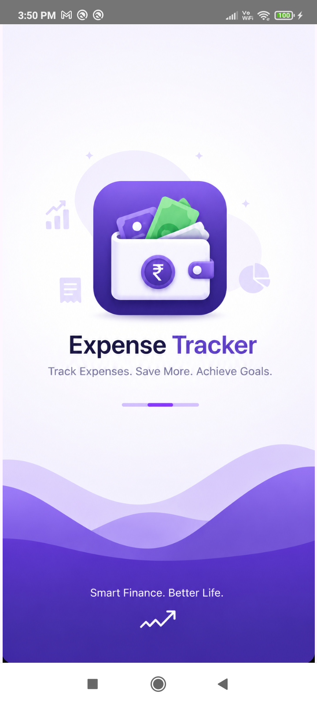

# 💰 ExpenseTracker - Smart Finance Manager

ExpenseTracker is a modern, professional, and intuitive Android application built with **Jetpack Compose** and **Material 3**. It follows the **MVVM architecture** to provide a seamless and robust user experience for managing personal finances.

<p align="center">
  
</p>

## ✨ Features

- **📊 Comprehensive Dashboard:** Real-time overview of your total balance, income, and expenses with a sleek visual interface.
- **📅 Transaction Management:** Easily add, search, and filter your daily expenses and income.
- **📈 Advanced Analytics:** Visualized spending patterns using interactive pie charts to help you understand where your money goes.
- **👛 Budget Planning:** Set monthly budget limits for different categories and stay on track with your financial goals.
- **👥 Contact-Based Ledger:** Unique feature to track "Got" and "Gave" transactions with specific contacts, perfect for personal lending and borrowing.
- **👤 Profile Personalization:** Manage your user profile with a profile picture and mobile number.
- **🌙 Dark/Light Mode Support:** Fully optimized for both themes using Material 3 dynamic color principles.

## 🛠 Tech Stack

- **UI Framework:** [Jetpack Compose](https://developer.android.com/jetpack/compose) - Modern declarative UI.
- **Language:** [Kotlin](https://kotlinlang.org/) - 100% type-safe and concise.
- **Architecture:** [MVVM (Model-View-ViewModel)](https://developer.android.com/topic/libraries/architecture/viewmodel) - Separation of concerns for maintainability.
- **Local Database:** [Room](https://developer.android.com/training/data-storage/room) - Robust SQLite abstraction layer.
- **Asynchronous Programming:** [Coroutines](https://kotlinlang.org/docs/coroutines-overview.html) & [Flow](https://kotlinlang.org/docs/flow.html) - Reactive data streams.
- **Image Loading:** [Coil](https://coil-kt.github.io/coil/) - Fast and lightweight image loading.
- **Data Storage:** [DataStore Preferences](https://developer.android.com/topic/libraries/architecture/datastore) - Modern alternative to SharedPreferences.
- **Dependency Injection:** Factory pattern for ViewModel provisioning.

## 📸 Screenshots

| Splash Screen | Dashboard | Analytics |
| :---: | :---: | :---: |
|  |  |  |

| Budget | Add Expense | Profile |
| :---: | :---: | :---: |
|  |  |  |

## 🏗 Project Structure

```text
com.example.expensetracker
├── data
│   ├── local      # Room DB, Entities, DAOs, DataStore
│   └── repository # Single source of truth for data
├── ui
│   └── theme      # Compose Screens, UI Components, Material Theme
├── viewmodel      # Business logic and UI State management
└── MainActivity   # Entry point and Navigation logic
```

## 🚀 Getting Started

1. Clone the repository:
   ```bash
   git clone https://github.com/karthikdofficial1998-hub/ExpenseTracker.git
   ```
2. Open the project in **Android Studio (Ladybug or newer)**.
3. Build and run on an emulator or physical device (Android 8.0+ recommended).

---
Developed with ❤️ by [Karthik](https://github.com/karthikdofficial1998-hub)
